<div align="center">

# Core Framework

### Build your design system once. Use it everywhere.

Core Framework is a visual CSS framework and design-token builder for the web, WordPress, and Figma.

[](https://github.com/corebunch/core-framework/releases)
[](https://github.com/corebunch/core-framework/stargazers)
[](LICENSE)
[](https://bun.sh)
[](https://wordpress.org/plugins/core-framework/)

[Website](https://coreframework.com) · [Product tour](#product-tour) · [Quick start](#quick-start) · [Documentation](https://docs.coreframework.com) · [Contributing](CONTRIBUTING.md) · [Marketplace](https://coreframework.com/marketplace)

<br>

<a href="docs/assets/readme/colors.jpg">
  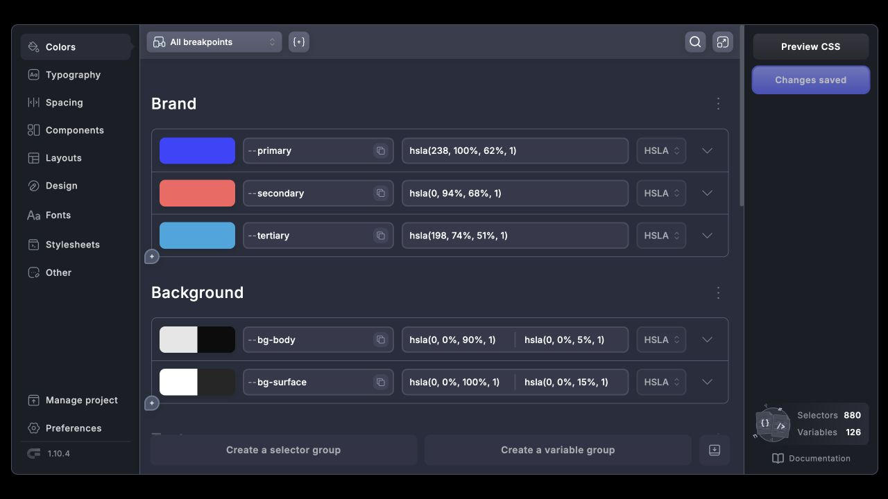
</a>

</div>

<br>

Core Framework turns colors, fluid type scales, spacing, layouts, components, and utility classes into one portable design system. Build the system visually, generate compact production CSS, and use the same tokens wherever you design and develop.

The web app, WordPress plugin, Figma integration, and every builder add-on in this repository are free and open source. There is no license activation, paid feature gate, or premium code path.

<div align="center">

**MIT licensed · Local-first editor · Portable projects · Every integration included**

</div>

## Why Core Framework?

A design system should be easier to understand than the CSS it generates. Core Framework gives the whole team a visual source of truth while keeping the output standards-based and portable.

- **Design visually.** Work with named tokens, responsive scales, reusable selectors, components, and utilities instead of editing a giant stylesheet by hand.
- **Stay systematic.** Generate typography and spacing scales from a small set of constraints, then reuse them consistently across the project.
- **Own the output.** Preview, copy, export, or download the generated CSS. Your project can also be exported as a portable `.core` file.
- **Work where you already build.** Use the standalone web app, WordPress, Figma, Gutenberg, Bricks, or Oxygen from the same open-source codebase.
- **Start your way.** Begin with the complete framework, variables only, a blank project, or an imported project.

## Product tour

Everything below is captured from the real Core Framework web app using its included starter project.

### Design tokens you can actually see

Define semantic colors, light and dark values, generated shades, and reusable variables from one workspace.

<a href="docs/assets/readme/colors.jpg">
  
</a>

### Fluid foundations

Typography and spacing scales respond to the viewport automatically. Choose minimum and maximum values, scale ratios, and a naming convention; Core Framework calculates the system and generates the matching classes.

<table>
  <tr>
    <td width="50%" valign="top">
      <a href="docs/assets/readme/typography.jpg">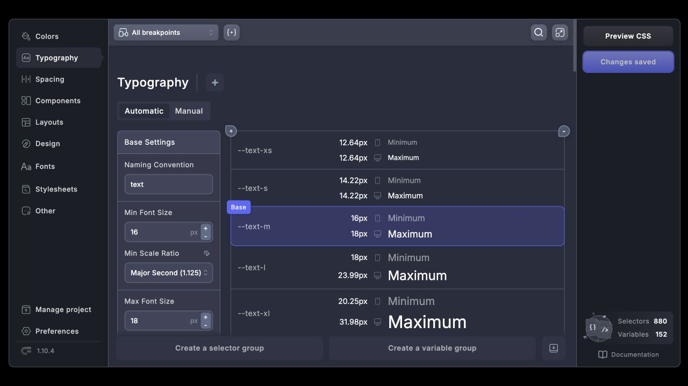</a>
      <br><strong>Fluid typography</strong><br>Build a responsive type scale with clear minimums, maximums, and contextual variables.
    </td>
    <td width="50%" valign="top">
      <a href="docs/assets/readme/spacing.jpg">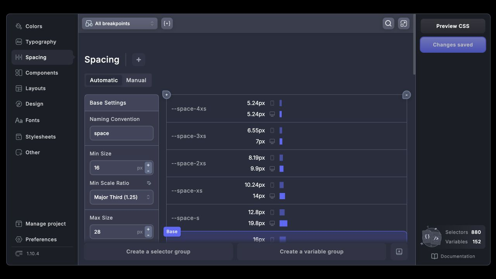</a>
      <br><strong>Fluid spacing</strong><br>Generate a consistent spacing rhythm and the utility classes that consume it.
    </td>
  </tr>
</table>

### From reusable components to production CSS

Preview components against the framework while you work, then inspect and export the generated stylesheet when the system is ready.

<table>
  <tr>
    <td width="50%" valign="top">
      <a href="docs/assets/readme/components.jpg">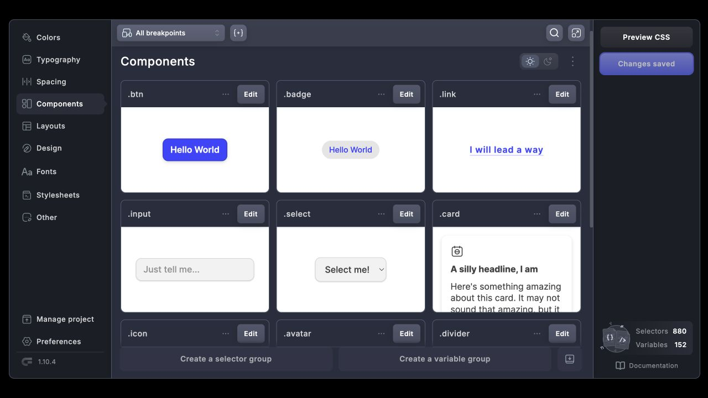</a>
      <br><strong>Component previews</strong><br>Buttons, badges, fields, cards, icons, avatars, and form controls are visible in the editor—not hidden in configuration.
    </td>
    <td width="50%" valign="top">
      <a href="docs/assets/readme/preview-css.jpg">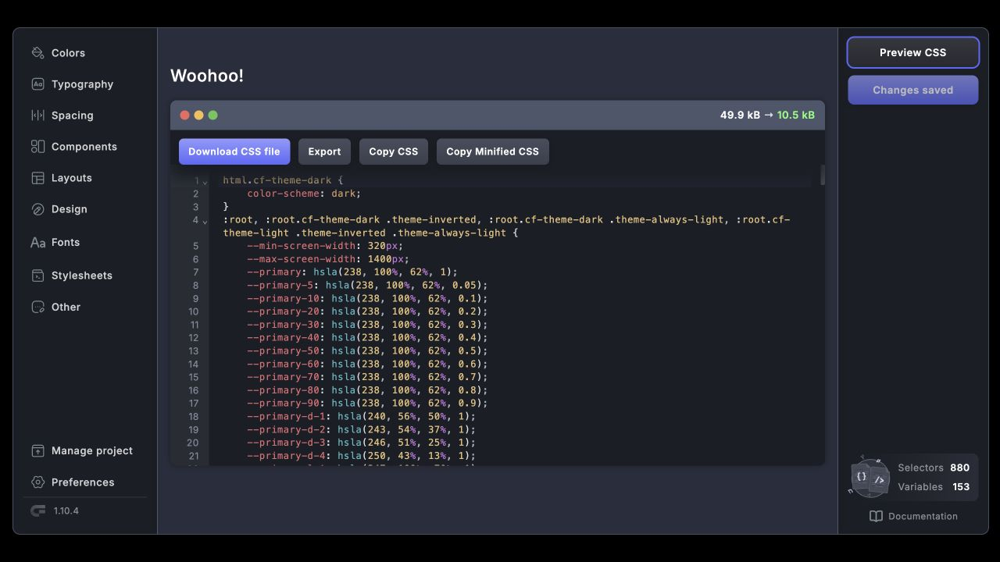</a>
      <br><strong>Generated CSS</strong><br>Preview the readable output, see its minified size, then download, export, or copy it directly.
    </td>
  </tr>
</table>

### Layout and design primitives

Keep grids, alignment rules, dimensions, radii, borders, shadows, opacity, filters, and transforms in the same system as your tokens.

<table>
  <tr>
    <td width="50%" valign="top">
      <a href="docs/assets/readme/layouts.jpg">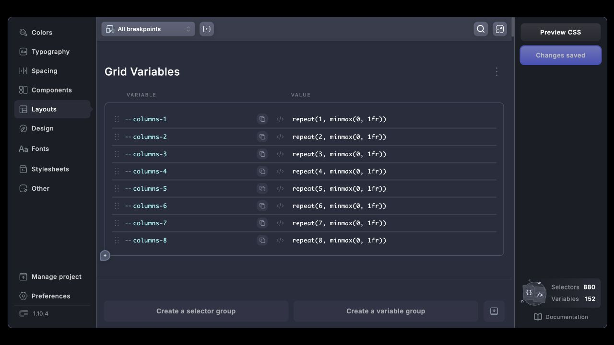</a>
      <br><strong>Layouts</strong><br>Reusable grid variables and selector groups make structural decisions explicit and portable.
    </td>
    <td width="50%" valign="top">
      <a href="docs/assets/readme/design.jpg">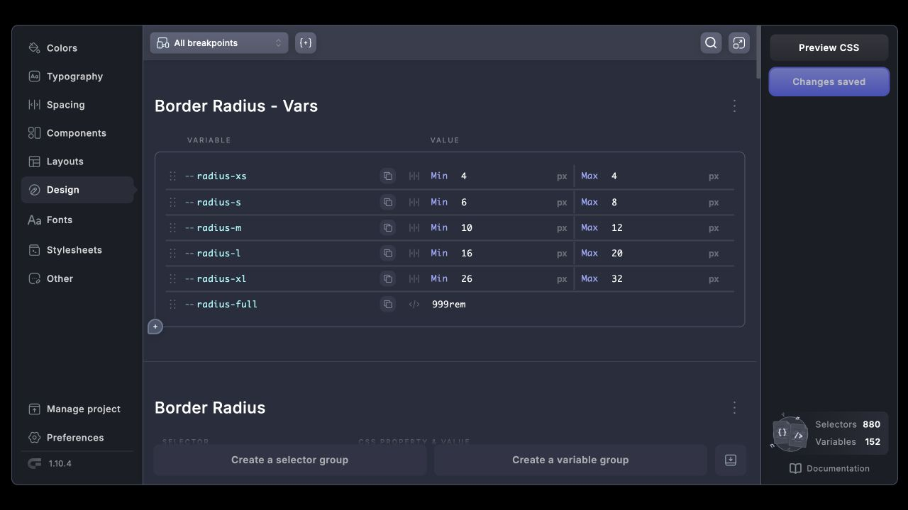</a>
      <br><strong>Design rules</strong><br>Model responsive radii and the visual primitives that keep an interface coherent.
    </td>
  </tr>
</table>

### Fonts and custom styles

Import Google Fonts through their public, keyless endpoints, configure selectors and variables, or add project-specific CSS in the built-in editor.

<table>
  <tr>
    <td width="50%" valign="top">
      <a href="docs/assets/readme/fonts.jpg">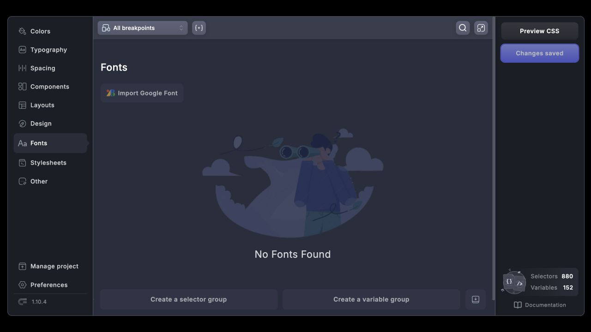</a>
      <br><strong>Font library</strong><br>Keep the fonts used by a project visible and manageable from a dedicated workspace.
    </td>
    <td width="50%" valign="top">
      <a href="docs/assets/readme/google-fonts.jpg">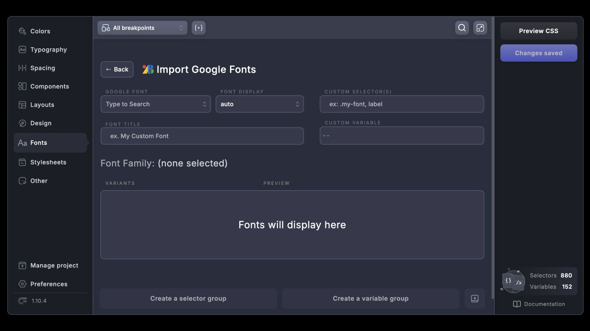</a>
      <br><strong>Google Fonts importer</strong><br>Choose a family and display mode, then map it to custom selectors or a CSS variable.
    </td>
  </tr>
  <tr>
    <td colspan="2" valign="top">
      <a href="docs/assets/readme/stylesheets.jpg">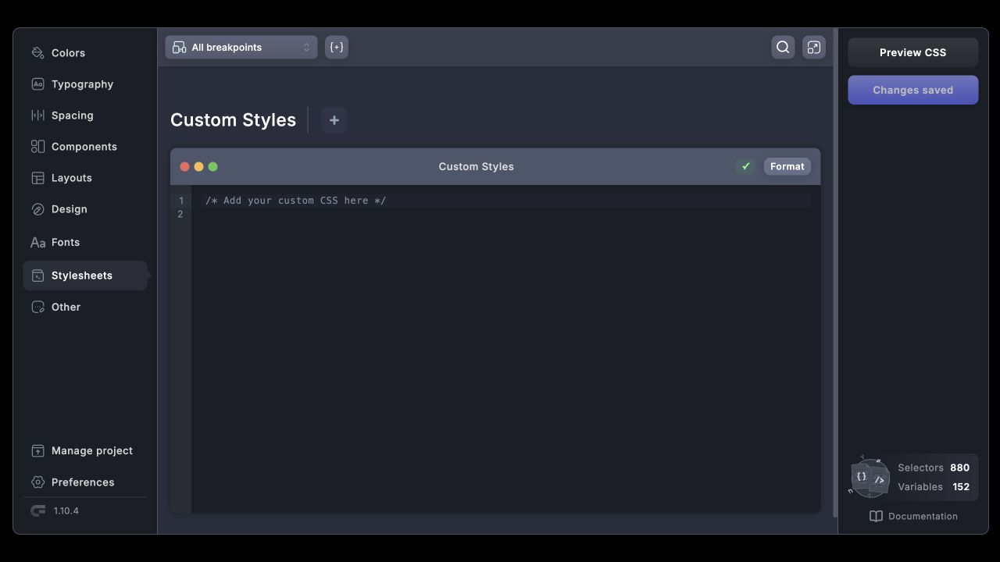</a>
      <br><strong>Custom stylesheets</strong><br>Add the small amount of handcrafted CSS that belongs alongside the generated framework.
    </td>
  </tr>
</table>

### A complete utility layer

Selectors and their CSS declarations stay readable in the visual editor, with breakpoint-aware controls and generated output behind them.

<a href="docs/assets/readme/other.jpg">
  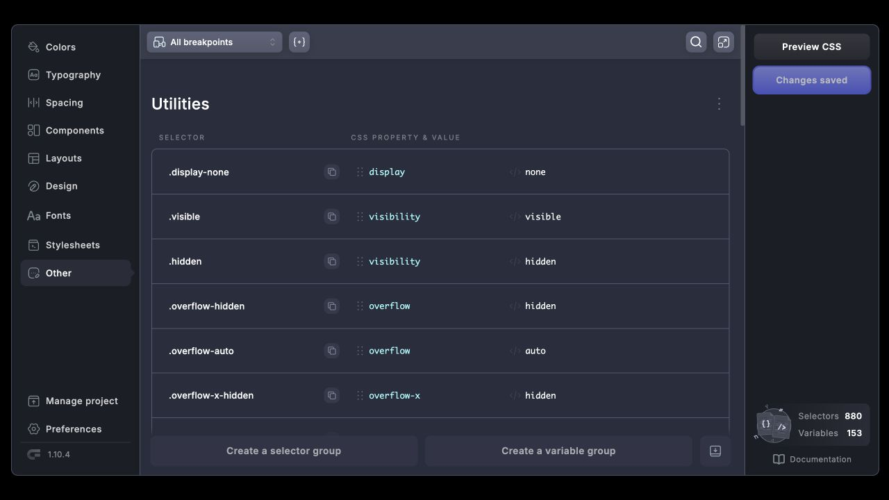
</a>

### Portable projects, deliberate defaults

Export or import a portable local `.core` file, and control how the final CSS behaves—from root sizing and themes to PostCSS, prefixes, reduced motion, and touch-device behavior.

<table>
  <tr>
    <td width="50%" valign="top">
      <a href="docs/assets/readme/manage-project.jpg">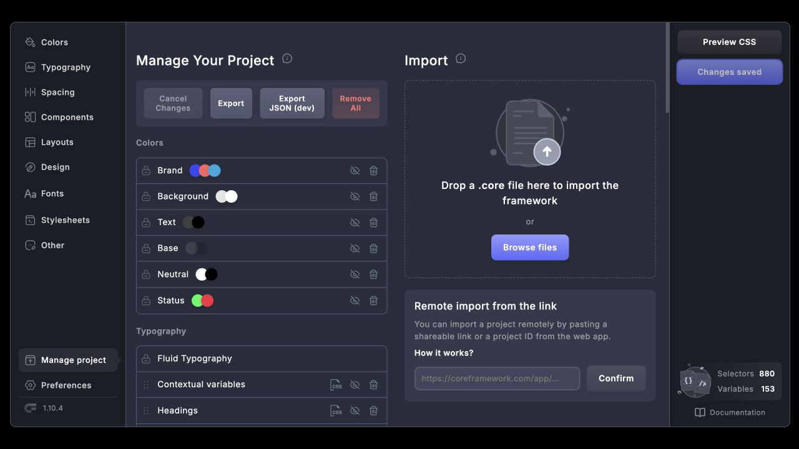</a>
      <br><strong>Manage the project</strong><br>Export, import, reorder, hide, or remove framework groups from one overview.
    </td>
    <td width="50%" valign="top">
      <a href="docs/assets/readme/preferences.jpg">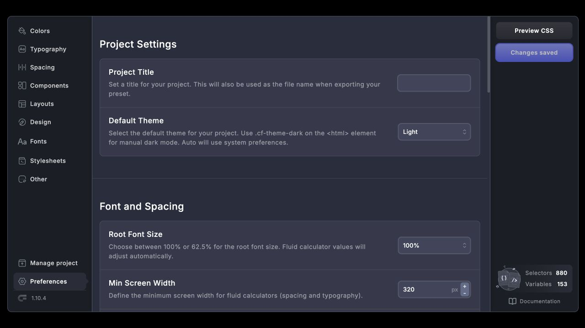</a>
      <br><strong>Set the rules</strong><br>Configure themes, viewport boundaries, unit output, processing, prefixes, and accessibility preferences.
    </td>
  </tr>
</table>

## Start with a framework—or a blank canvas

The standalone app stores projects in browser storage, so exploring Core Framework does not require WordPress, an account, or a hosted backend.

<table>
  <tr>
    <td width="50%" valign="top">
      <a href="docs/assets/readme/onboarding.jpg">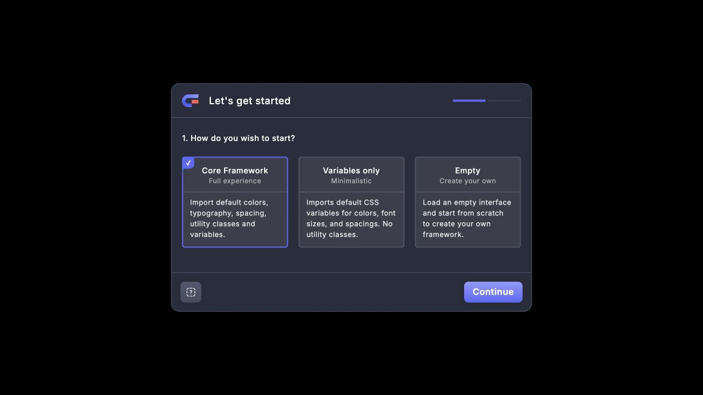</a>
      <br><strong>Choose your starting point</strong><br>Load the full framework, import variables only, or begin empty.
    </td>
    <td width="50%" valign="top">
      <a href="docs/assets/readme/onboarding-preferences.jpg">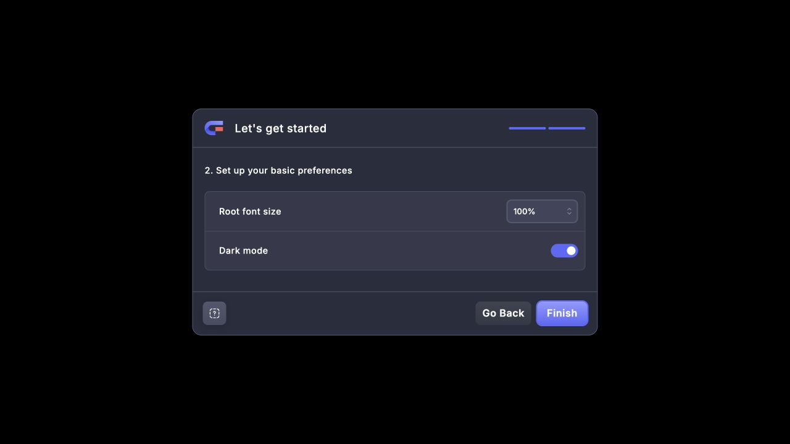</a>
      <br><strong>Choose the foundation</strong><br>Set the root font size and color mode before entering the editor.
    </td>
  </tr>
</table>

## What's included

| Surface | Package | What it provides |
|---|---|---|
| Shared application | `packages/core` | Visual editor, schemas, state, CSS generation, and shared business logic |
| Web app | `packages/www` | Standalone browser app with local project storage |
| WordPress | `packages/wp` | Plugin shell, persistence, REST API, generated CSS delivery, and release packaging |
| Figma | `packages/figma` | Self-contained Figma plugin with the editor bundled into the plugin UI |
| Gutenberg | `packages/gutenberg`, `packages/blocks` | Classes, colors, theme preview, editor integration, and blocks |
| Bricks and Oxygen | `packages/builder-integrations` | Classes, variables, colors, and builder-specific helpers |

All integrations in this repository are included under the MIT license. Optional design kits and packs are separate marketplace content; they are not required to use any application or integration.

## Quick start

### Run the web app

You need [Bun 1.3.x](https://bun.sh).

```sh
git clone https://github.com/corebunch/core-framework.git
cd core-framework
bun install
bun run dev:www
```

Open the local URL printed by Vite. Choose a starting point and the editor is ready—no account, API key, or license activation required.

### Build the web app

```sh
bun run test:www
bun run build:www
```

The production site is written to `packages/www/dist`. It is a static application: serve that directory from any static web server or hosting provider. Projects remain in the user's browser storage; no application server, database, Core Framework account, or license service is required.

For a domain root such as `https://framework.example.com/`, use the command above. For a subpath, pass the public base path to Vite:

```sh
bun run --filter './packages/www' build -- --base=/core-framework/
```

Then publish `packages/www/dist` at the matching path, such as `https://example.com/core-framework/`.

## WordPress development

Requirements: WordPress 6.6 or newer, PHP 8.0 or newer, Composer, Bun 1.3.x, and a local HTTPS certificate.

1. Link the plugin package into your WordPress installation:

   ```sh
   ln -s <path-to-core-framework>/packages/wp <path-to-wordpress>/wp-content/plugins/core-framework
   ```

2. Copy `packages/wp/.env.example` to `packages/wp/.env`, then set `DEV_URL`, `DEV_PROTOCOL`, and `CERT_PATH` for the local site.

3. Install PHP dependencies and start development:

   ```sh
   cd packages/wp
   bun run composer:dev
   cd ../..
   bun run dev:wp
   ```

4. Activate **Core Framework** in WordPress.

Build the production plugin with `bun run build:wp`. Tagged releases are assembled by the automated release workflow; pushes to `main` do not publish a plugin update. Maintainers can find the full process in [RELEASING.md](RELEASING.md).

Run `bun run e2e:wp` to build the distributable ZIP and install it into a disposable Docker-based WordPress site. The test uses WP-CLI to verify installation, activation, database setup, generated CSS, REST authorization, the Figma connection-key lifecycle, local editor assets, and deactivation/reactivation. Docker and curl are required; the test environment is removed automatically.

## Install the Figma plugin

Each [GitHub Release](https://github.com/corebunch/core-framework/releases) includes a self-contained `core-framework-figma-X.Y.Z.zip`:

1. Download and extract the Figma ZIP.
2. Open Figma Desktop.
3. Go to **Plugins → Development → Import plugin from manifest**.
4. Select `core-framework-figma/manifest.json` from the extracted folder.

This local installation is independent of Figma Community and does not update automatically. Download and import the newer archive when a new release is available. Publishing an update to Figma Community is a separate maintainer action in Figma Desktop; the GitHub release workflow does not publish to Community.

## Figma development

```sh
bun run build:figma
```

In Figma, open **Plugins → Development → Import plugin from manifest** and select `packages/figma/manifest.json`. Run `bun run dev:figma` while working on the plugin. The shared editor is built into the plugin; no hosted Core Framework app or license key is required.

## How the repository fits together

```text
packages/core                  Shared application and CSS engine
       │
       ├── packages/www        Standalone, browser-storage app
       ├── packages/wp         WordPress plugin and REST integration
       └── packages/figma      Figma plugin and sandbox

packages/gutenberg            WordPress editor integration
packages/blocks               Gutenberg blocks
packages/builder-integrations Bricks and Oxygen bundles
```

The visual application lives in `packages/core`. The web, WordPress, and Figma packages provide platform-specific storage, transport, and integration layers around that shared system.

## Development commands

| Command | Purpose |
|---|---|
| `bun run dev:www` | Start the standalone web app |
| `bun run test:www` | Run web-app tests |
| `bun run build:www` | Build the standalone web app |
| `bun run dev:wp` | Build integrations and start WordPress development |
| `bun run build:wp` | Build WordPress assets |
| `bun run php-test:wp` | Run WordPress PHP tests after Composer install |
| `bun run dev:figma` | Watch the Figma plugin |
| `bun run build:figma` | Build the Figma plugin |
| `bun run release:figma -- X.Y.Z` | Build the self-contained Figma release ZIP |
| `bun run lint` | Lint the web and WordPress packages |

## Hosted services and privacy

Editing a local project and generating CSS do not require a Core Framework account, license server, or API key. The bundled Figma editor works locally, while optional Figma-to-WordPress synchronization connects directly to a user-selected WordPress site using a site-generated connection credential (not a license key).

The Google Fonts catalog is bundled locally. Google is contacted only when a user selects, previews, or imports a Google-hosted font; the application requests CSS from `fonts.googleapis.com` and, during import, font files from `fonts.gstatic.com`. The WordPress integration stores imported font files locally. See Google's [Terms of Service](https://policies.google.com/terms) and [Privacy Policy](https://policies.google.com/privacy).

The application does not load preview images, interface fonts, telemetry, or executable code from Core Framework servers.

## Third-party licensing

Core Framework's original source is MIT licensed. Dependencies and adapted source retain their respective open-source licenses. Release builds include `THIRD_PARTY_NOTICES.md` (or `third-party-notices.txt`) and a generated `THIRD_PARTY_LICENSES.txt` (or `third-party-licenses.txt`) containing the production dependency inventory and available license texts.

## Marketplace

The [Core Framework Marketplace](https://coreframework.com/marketplace) offers optional design kits and packs. These are content products, live outside this repository, and are not required to use the plugin, web app, Figma integration, or builder integrations.

## Who's behind this

Core Framework is built by a team focused on giving designers and developers powerful visual tools without taking away ownership of their work. We also build:

- **[Motion.page](https://motion.page)** — a complete visual animation stack for the web, combining a desktop app, an SDK, and a WordPress plugin. Build professional timelines, interactions, scroll effects, and responsive animations visually, then use them on any website—not only WordPress—through Motion.page's independent animation engine and tooling.
- **[Instatic](https://instatic.com)** — a free, full-featured, open-source alternative to Framer, Webflow, and WordPress. It is a self-hosted visual CMS for building and managing fast, content-driven websites. Explore the project at [instatic.com](https://instatic.com) or view the source on [GitHub](https://github.com/corebunch/instatic).

## Contributing

Bug reports, focused pull requests, tests, and documentation improvements are welcome. Read [CONTRIBUTING.md](CONTRIBUTING.md) before opening a pull request. Report security vulnerabilities privately using the process in [SECURITY.md](SECURITY.md).

## License

Core Framework is released under the [MIT License](LICENSE). Third-party notices are listed in [THIRD_PARTY_NOTICES.md](THIRD_PARTY_NOTICES.md).
